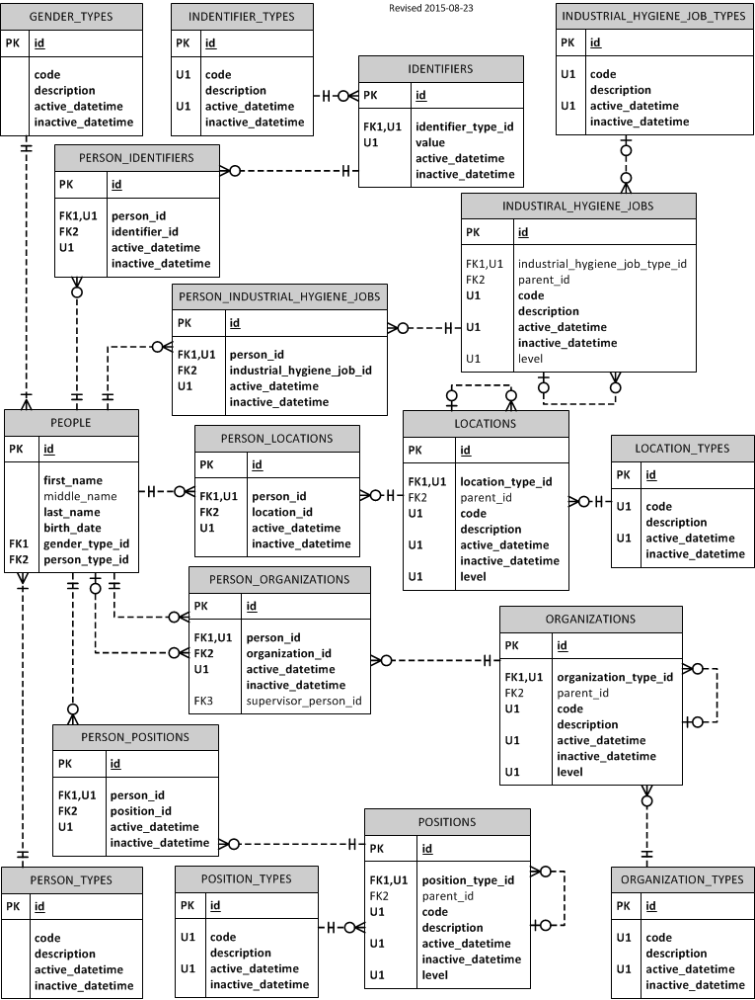

# people

##Overview
People is your somewhat typical human resources application (not payroll).  It 
will be shared by all other applications but herewith.  Version 1 will be your
basic Ruby on Rails application paried with Bootstrap and PostgreSQL on the
backend.

Version 2 will be either an Angular JS or Ext JS implementation of the 
presentation layer.  Much can be learned by doning both.

